# latexhelper

A simple tool for writing latex in vscode. [Chinese document](https://www.wolai.com/tx-leo/afrUuns8wW44AdERsoWasC)

## requirements

The project is supported on both Windows and Linux.

* Python3 (Python 3.8 best)

* git

* Anaconda

## build

We suggest [Anaconda](https://www.anaconda.com/) to setup all the running environment.

### preparation before setup

In order to avoid unknown problems, we suggest using `python3.8` to run this project.

```bash
$ conda create -n latex python=3.8 # the environment name is not important, you can choose other name, or you can just install in base
## you can change your conda source for faster speed:
# conda config --add channels https://mirrors.tuna.tsinghua.edu.cn/anaconda/pkgs/free/
# conda config --add channels https://mirrors.tuna.tsinghua.edu.cn/anaconda/pkgs/main/
# conda config --add channels https://mirrors.tuna.tsinghua.edu.cn/anaconda/cloud/pytorch/
# conda config --add channels https://mirrors.tuna.tsinghua.edu.cn/anaconda/cloud/conda-forge/
# conda config --set show_channel_urls yes
$ conda install pip
## you can change your pip source for faster speed:
# pip config set global.index-url https://pypi.tuna.tsinghua.edu.cn/simple
```

### setup the project

```bash
# install scripts
$ git clone git@github.com:git@github.com:LaTeXhelper/LaTeX-helper.git
# or git clone https://github.com/LaTeXhelper/LaTeX-helper.git
$ cd LaTeX-helper
$ conda activate latex # same as your previous name
$ pip install -r requirements.txt
$ python setup.py install
# install templates
$ git clone git@github.com:LaTeXhelper/LaTeX-templates.git ~/.latexhelper
# or git clone https://github.com/LaTeXhelper/LaTeX-templates.git ~/.latexhelper
```

Then, you can use `latexhelper`，`generate_pdf.sh`，`generate_ppt.sh` (on linux) or `generate_pdf.ps1`, `generate_ppt.ps1` (on windows) command after `conda activate latex`(or some other environment name you set before).

**important!!** You may see this problem on Windows when installing the project:

> error: [WinError 32] 另一个程序正在使用此文件，进程无法访问。: 'c:\\users\\xxx\\.conda\\envs\\latex3.8\\lib\\site-packages\\latexhelper-1.0-py3.8.egg'

Then just run `del c:\\users\\xxx\\.conda\\envs\\latex3.8\\lib\\site-packages\\latexhelper-1.0-py3.8.egg` in terminal, and rerun `python setup.py install`.

### edit the config file

The config file path is `~/.latexhelper/config.yaml`, like this:

```yaml
table_style: 1 # 默认表格样式
windows_editor: notepad # windows平台下，创建模板使用的默认编辑器
linux_editor: vim # linux平台下，创建模板使用的默认编辑器
windows_json_path: None # windows平台下，生成的用户代码片段json文件的输出路径，需要用户自行添加
linux_json_path: None # linux平台下，生成的用户代码片段json文件的输出路径，需要用户自行添加
using_utf8: true # 在使用markdown生成latex PDF时，是否支持utf-8
using_section_number: false # 在使用markdown生成latex PDF时，是否对标题进行标号
tex_compiler: xelatex # 在使用markdown生成latex PDF时，使用的latex编译器
tex_trash_files: 
  - .aux
  - .log
  - .out
  - .toc
```

The json file path is usually like this: `~\AppData\Roaming\Code\User\snippets\latex.json`

## usage

### `latexhelper -h | --help`

Show help information. And you can also see the template path, pdf path and config path so that you can edit them.

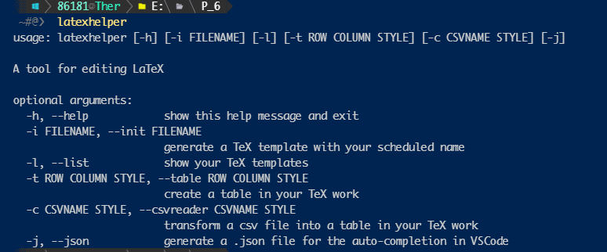

### `latexhelper -i | --init <template name>`

Generate a TeX template with your scheduled name. For example, if you want to create a template for writing Maxwell equations, you can input `latexhelper -i maxwell.tex`, then input its document type and content type for searching in the future:

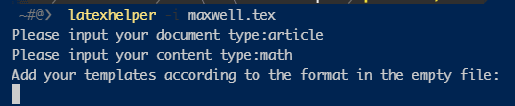

Then, you can add your template in the text editor. And you'd better add a simple description and required packages for your template:

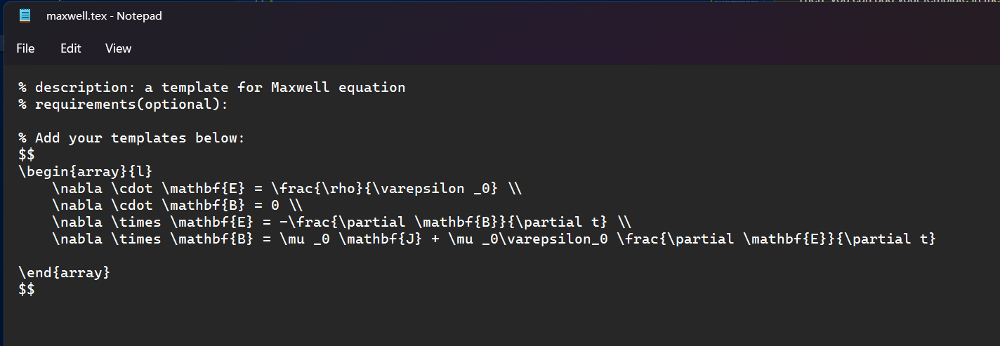

After closing the file, the template will be saved in a specified path:

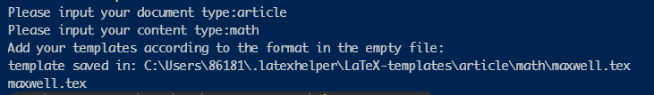

### `latexhelper -l | --list`

Print all the available templates in  pandas-Dataframe format, including their document type, content type, description(if available), preview pdf path(if available):

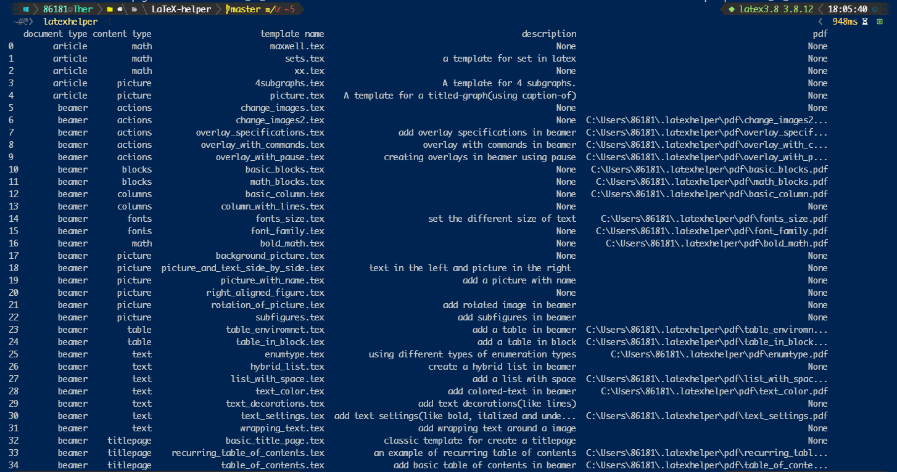

### `latexhelper -t | --table <rows> <columns> <style>`

Generate empty tables. The `<style>` option is optional. For example:

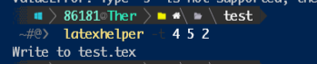

Which means generate a 4-rows and 5-columns table with style 2. Then the table data will be written in the .tex file under current folder.

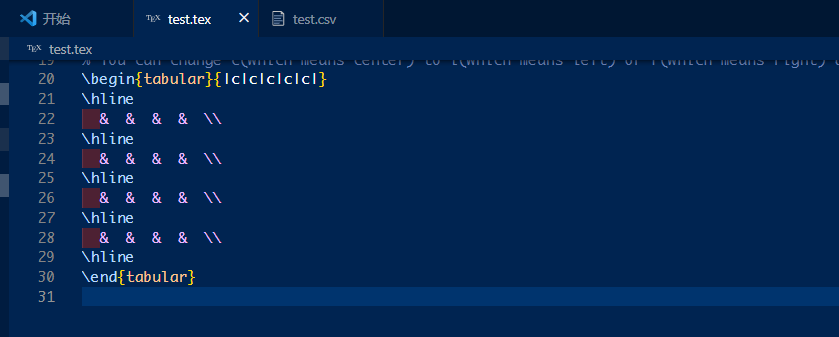

> We have 4 styles: "no_lines": 1, "full_lines": 2, "three_lines": 3 "bold_three_lines": 4.

### `latexhelper -j | --json`

Generate a json file for automatic code completion in vscode using all your templates, like this:

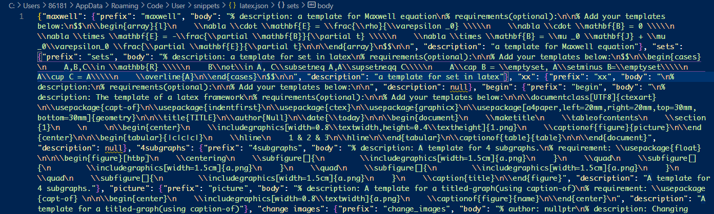

For better effect, you should **format** the json file (see [json_format](https://code.visualstudio.com/docs/languages/json)), like this:

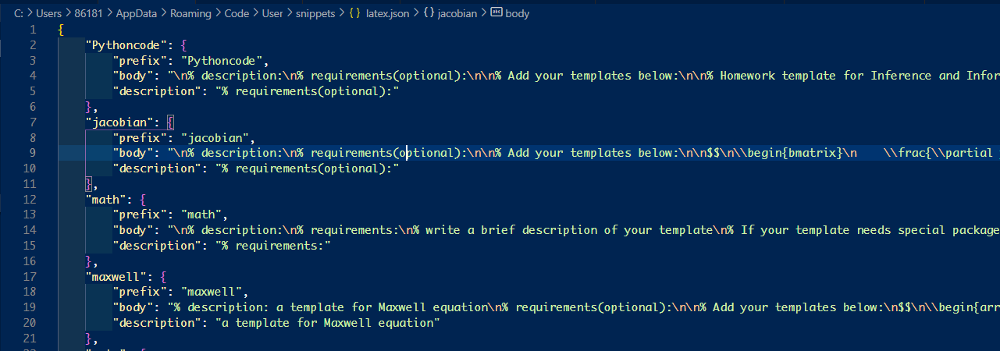

Then you can use your template via automatic code completion in vscode.

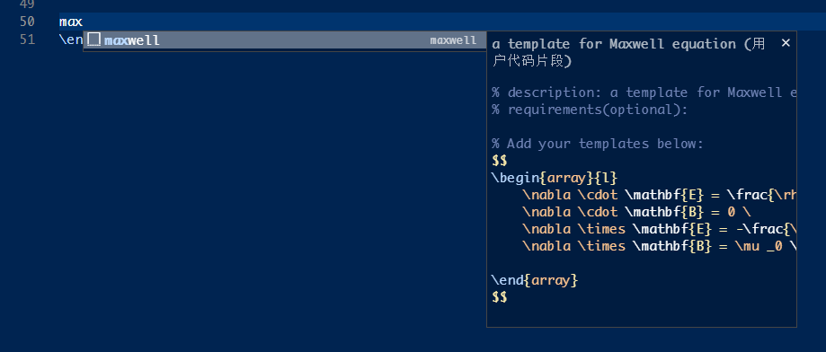

### `latexhelper -c | --csvreader <csv_name> <style>`

Convert a .csv file to a latex table. For example, `test.csv` like this:

```
1,2,3
4,5,6
7,8,9
```

Then you can run the following command:


Then the table data will be written in the .tex file under current folder.

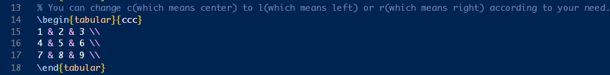

### `latexhelper -m | --md <markdown_name>` 

Convert a markdown file into a LaTeX-style with pandoc. But it is more beautiful and it can support Chinese.

The `README.pdf` is generated in this method!


### PDF generating

On Windows,  users can use `generate_pdf.ps1` and `generate_ppt.ps1` to generate preview pdfs for artile templates and beamer templates you have created before. Like this:

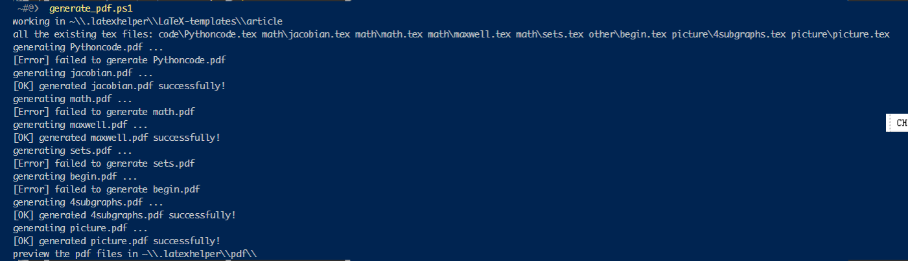

On Linux, users can use `generate_pdf.sh` and `generate_ppt.sh` to generate preview pdfs for artile templates and beamer templates you have created before. Like this:

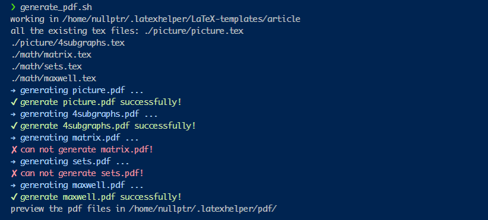

> Warning: Not every template can generate pdf successfully. That is depend on your template content.

Here is a pdf example for `maxwell.tex`:

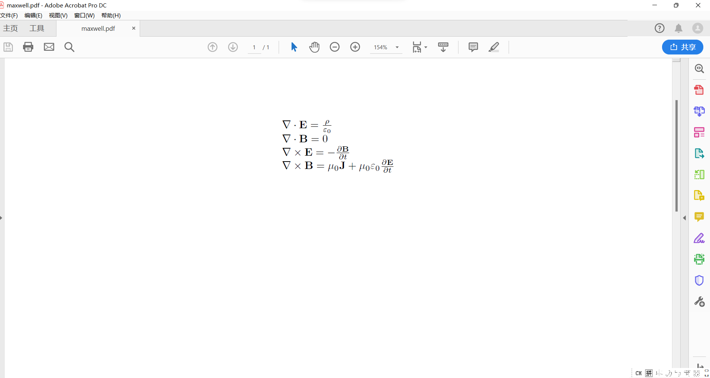

## Developers

Yujin Wang, Zhi Wang, Jianwei Zhu.

## Special thanks

[Theodore Wan](https://github.com/Wave7t)
